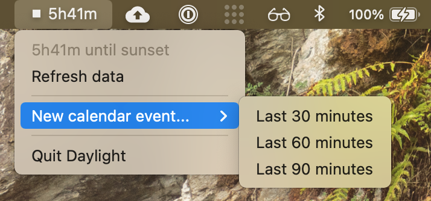

# daylight [](https://pkg.go.dev/github.com/lukasschwab/daylight)

`daylight` is a little macOS status bar app for telling you how much daylight remains.

+ Check a status bar countdown of how much daylight is left.
+ Create a calendar event for the last `n` minutes of daylight.

Due credit: `daylight` uses [progrium/macdriver](https://github.com/progrium/macdriver)'s Go bindings for Cocoa APIs and data from [chubin/wttr.in](https://github.com/chubin/wttr.in).



## Usage

1. Download the latest version of Daylight.zip from [Releases](https://github.com/lukasschwab/daylight/releases).
2. Unzip Daylight.zip; this yields Daylight.app, the application bundle.
3. Move Daylight.app into your Applications folder.

### Changing the location

Because wttr.in's location inference is inconsistent, [data.go](./data.go) requests wttr.in data for a hardcoded city (San Francisco, CA). If you want to use the app at some other latitudde, you'll need to change `wttrURL` to reflect that!

1. Clone or download this repository.
2. Find the definition of `wttrURL` in [data.go](./data.go). Replace `San+Francisco` with your location. For example, if you're in Kansas City, you should have ```wttrURL = `https://wttr.in/Kansas+City?format={"sunrise":"%S","sunset":"%s"}` ```.
3. Run `make install` to build the application bundle and move it into your Applications folder.

### Development

The [Makefile](./Makefile) offers standard targets for building, running, and bundling Daylight. There are two make targets of particular interest for debugging:

+ `make dev` includes `cmd/daylight/dev.go` in the build. That causes logs to be double-written, to `stdout` and to the specified log file. See Go's [Build constraints](https://golang.org/cmd/go/#hdr-Build_constraints) docs for an explanation of how this works.
+ `make run` runs a dev binary.

`make app` composes a macOS application bundle, and `make install` copies that bundle into your `/Applications` directory (overwriting any existing installation).
